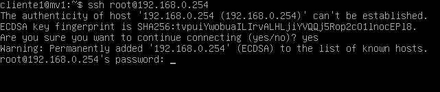
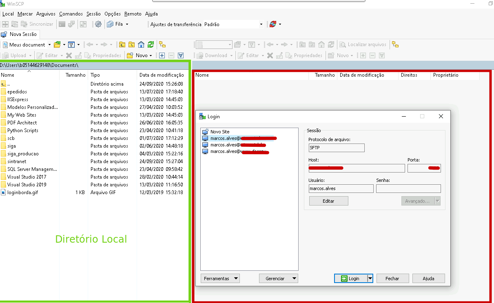

<h1> Atividade Assíncrona - Semana 2 </h1>

**Autor: Marcos Wesley Soares Alves**

**Matricula: 20181070130258**

## Instalação do SSH

  - Primeiramente vamos atualizar o repositório debian onde está localizados os pacotes. Após acessar o servidor a partir do virtual box, digite o comando abaixo para fazer a atualização:
    
        apt-get update

- Com o repositório atualizado, agora vamos instalar o serviço **SSH** através do comando:

        apt-get install ssh

- **Acessando o servidor a partir do cliente**

    A partir do nosso ambiente de realização de atividades práticas onde temos dois computadores (cliente1 e cliente2). Vamos acessar a partir do cliente1 (sem interface gráfica) o servidor via SSH. 

    No debian o SSH cliente já está previamente carregado. Para verificar você pode digitar ssh na linha de comando. Se o serviço estiver disponível será apresentado algumas informações como na imagem abaixo:

    

        
    

    Para fazer um acesso remoto do cliente via ssh ao servidor, vamos digitar o seguinte comando:

            ssh root@192.168.0.254

    No primeiro acesso que eu fizer via ssh a qualquer máquina vai aparecer essa mensagem perguntando se eu quero me conectar e vai informar um fingerprint da chave de criptografia da máquina. Essa chave será gravada em um arquivo para futuramente se eu acessar uma outra máquina cujo ip for o mesmo, será verificado se essa chave é a mesma. Por questão de segurança sempre será informado caso ele encontre uma nova chave ou uma chave diferente pra um determinado ip. Sabendo disso podemos colocar sim e apertar a tecla enter.

    

        
    

    Será solicitado a senha do usuário que você está tentando acessar, no nosso caso o usuário é root.

    

        
    

    Após informar a senha você vai estar conectado ao servidor.

     

        
    

    Para verificar as máquinas que estão conectadas ao servidor, você pode usar o comando *who* ou apenas *w*.

    

                
    

    Através dos comandos é possível verificar que a máquina de ip 192.168.0.1 está conectado ao servidor.

    Aprendemos nessa seção como instalar e nos conectar a um servidor via ssh(Secure Shell). Porém devemos tomar cuidado com algumas configurações de acesso como por exemplo a porta e o usuário ao qual estamos nos conectando, pois isso pode causar diversos problemas de segurança. Esse será o assunto do próximo tópico.

    

## Alterando arquivo de configuração do SSH

Por questões de segurança algumas configuração devem ser realizadas para dificultar um pouco o acesso ao nosso servidor via ssh. Nesse tópico vamos bloquear o acesso ao usuário root e mudar a porta padrão de acesso.

- **Bloqueando acesso ao usuário root e alterando a porta padrão**

Através do comando abaixo, é possível acessar o arquivo de configuração *sshd_config*. O editor que vou usar é o nano mas você pode usar outros como o vim ou o gedit.

    nano /etc/ssh/sshd_config

    

Podemos observar que a porta padrão é a porta 22 e a linha *PermitRootLogin* está configurado com yes, o que permite acessar o usuário root caso saibamos a senha. Vamos mudar essas configurações, colocando a porta como 2222 e passando **no** para a linha *PermitRootLogin*. Nosso arquivo de configuração deve ficar como a figura abaixo.

    

Para salvar é só apertar CTRL+O e em seguida confirmar como a tecla Enter. E por fim para voltar ao terminal CTRL+X.
Após modificar as configurações devemos reiniciar o serviço ssh para que as alterações sejam aplicadas. Para isso vamos digitar o seguinte comando no terminal.

    /etc/init.d/ssh restart

    

- Vamos fazer um teste e tentar acessar a partir do cliente1 o servidor como fizemos no tópico anterior.

    

        
    

    Em 1, tentamos acessar com a porta padrão e o usuário root e então obtemos a mensagem Connection refused. 

    Em 2, colocamos a porta que haviamos definido e ainda assim não foi possível acessar o servidor através do usuário root (pois definimos que não deveria ser permitido acessar através desse usuário).

- Agora vamos tentar fazer o acesso usando outro usuário e passando a porta que definimos no arquivo de configuração.

    

Usando o usuário *servidor* e passando a porta 2222 conseguimos realizar a conexão.

## Realizando cópia de arquivos do servidor para o cliente

Neste tópico será abordado a cópia de arquivos do servidor para o cliente. Podemos fazer essa transferência via rede usando o scp via terminal ou através de programas como gftp ou o filezilla caso esteja disponível um ambiente gráfico.

- **Sem interface gráfica (SCP)**

O SCP (Secure Copy) é um protocolo de rede para transferências de arquivos. Esse protocolo que iremos usar nesse exemplo

**Passo 1:** Criar um arquivo(file_teste) no servidor.

    touch arquivo_teste

    

Com o arquivo criado vamos copiá-lo para o cliente1.

**Passo 2:** Cópia do arquivo através da rede

Para copiar o arquivo temos que saber o caminho onde ele se encontra na origem (servidor) e para qual caminho queremos salvar no destino(cliente). No nosso caso o path de origem é: */home/servidor* e o path de destino é: *home/cliente1*. Então usando o scp vamos conectar ao servidor e realizar a cópia do arquivo.

    scp -P 2222 servidor@192.168.0.254:home/servidor/arquivo_teste /home/cliente1

    

Como podemos observar através do comando *ls* o arquivo agora está na máquina cliente1.

- **Utilizando a interface gráfica (gftp)**

Para esse exemplo vamos usar o cliente 2 que tem interface gráfica. Para realizar a instalação da ferramenta gftp tivemos que modificar as configurações de rede para que fosse possível acessar a internet e baixar os pacotes necessários. Para isso editamos o arquivo *interfaces* e através da opção *Configurações de rede* da máquina virtual alteramos a opção de rede interna para NAT.

*Configurações originais*

    

*Configurações para instalação do gftp*

    

Obs: Para alterar o arquivo interfaces você deve usar o usuário root. Para isso basta digitar *su* no terminal e informar a senha do usuário root.

Após a modificação do arquivo interfaces, digite os seguintes comandos para aplicar as configurações a interface de rede.

    ifdow enp0s3 ou /sbin/ifdown enp0s3
    ifup enp0s3 ou /sbin/ifup enp0s3

    

**1 - Instalação**

Agora podemos fazer a instalação da ferramenta através dos comandos abaixo

    apt-get install update
    apt-get install gftp

Ao fim da instalação você pode acessar a aplicação através do *menu -> internet -> gftp*

    

**2 - Realizando a cópia de uma arquivo do servidor**

Para realizar a cópia de uma arquivo primeiro vamos desfazer as alterações que realizamos no arquivo interfaces e voltado a configuração na nossa máquina para *rede interna*.

    

    ifdow enp0s3 ou /sbin/ifdown enp0s3
    ifup enp0s3 ou /sbin/ifup enp0s3

Com as cofigurações originais setadas, podemos acessar o servidor via protocolo SSH. Vamos iniciar nossa aplicação *gftp*.

    

Na imagem podemos observar três áreas:

A área *vermelha* é onde vamos adicionar as informações para acessar o servidor, o ip da máquina a porta o usuário ao qual queremos nos conectar e o protocolo a ser usado.

A área *azul* são os diretórios da nossa máquina.

E a área *verde* é onde serão apresentados os diretório do servidor assim que a conexão estiver estabelecida.

Credenciais de acesso:

    IP: 192.168.0.254
    Porta: 2222
    Usuário: servidor
    Protocolo: SSH2
      
Ao acessar o servidor pela primeira vez, será mostrado a mensagem abaixo, então basta selecionar a opção *sim*.

    

Podemos obsevar na aba da direita alguns arquivos no diretório */home/servidor*.

    

Vamos então copiar o arquivo *arquivo_teste* do servidor para o diretório */home/cliente2/Desktop*.

**Passo 1:** Selecione na aba do servidor o arquivos que deseja copiar

**Passo 2:** Clique na seta para a esquerda.

    

Pronto, o seu arquivo foi copiado do servidor para a máquina cliente2. Existem diversas outras ferramentas com interface gráfica como o *gftp* como o filezilla também para linux e o winscp para windows. 

A nível de curiosidade irei apresentar um pouco do *winSCP* e o *putty* que uso no dia a dia no trabalho.

## WinScp e Putty

No meu trabalho no IPEA usamos máquinas com sistema operacional windows, porém muitos dos servidores são linux. Então usamos algumas ferramentas como o *putty* e o *winscp* para acessar alguns servidores para dar permissão a um usuário ou acessar determinada aplicação. Abaixo segue algumas imagens dessas aplicações.

- **Putty**

    

Após informar as credenciais de acesso (que por questão de segurança e contrato não vou poder mostrar) já estou acessando o servidor que desejo via terminal.

    

Em verde podemos verificar o ultimo acesso que foi da minha máquina de tabalho *ebsb0460*.

- **WinSCP**

Uso bastante essa ferramenta para acessar aplicações em ambiente de desenvolvimento, realizar manutenção em códigos e então solicitar o envio pro ambiente de homologação e posteriormente para o ambiente de produção. A transferência dos arquivos é realizado pela equipe de rede que usa o putty para realizar as cópias de um ambiente para o outro.

    

    

