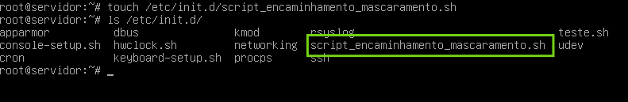

<h2> Atividade Assíncrona - Semana 3 - Encaminhamento/Mascaramento </h2>

**Autor: Marcos Wesley Soares Alves**

**Matricula: 20181070130258**

Responda as seguintes perguntas:

1) O que é Servidor Nat?
    
    R: Pode ser entendido como um servidor que será responsável por fazer a tradução de endereços de uma rede interna para em endereços da Internet.

2) Qual é o arquivo do GNU/Linux Debian que permite/bloqueia o encaminhamento de pacotes?
    
    R: O nome do arquivo é ip_foward que se encontra no path: */proc/sys/net/ipv4*

3) O que é mascaramento de pacotes?

    R: É uma camada adicional de informação que permite ao servidor conhecer o host a qual o pacote deve ser encaminhado. 

4) O que é necessário ativar para que o servidor torne-se provedor de internet para os cliente 01 e 02?
   
    R: Ativar o encaminhamento de pacotes entre redes e fazer o mascaramento de pacotes.
        
            iptables -t nat -A POSTROUTING -o eth0 -j MASQUERADE

            echo "1" > /proc/sys/net/ipv4/ip_forward

5) Como ativar permanentemente o encaminhamento/mascaramento de pacotes no servidor? Em outras palavras, crie um tutorial (passo-a-passo) que indique uma forma permanente que garanta que o servidor, mesmo após o processo de reboot, seja um servidor NAT para os clientes do cenário de simulação, ou seja, faça o encaminhamento e o mascaramento de pacotes.

**Criação de um script shell**

1 - Criar um arquivo shell script no diretório /etc/init.d que será executado sempre que o sistema operacional inicializar

   

        
    

2 - Adicionar os comando de ativação NAT e mascaramento de pacotes no arquivo shell.

    nano script_conf_nat.sh

