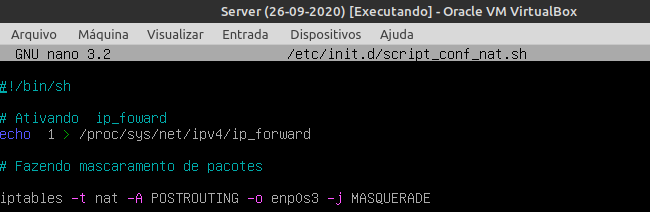
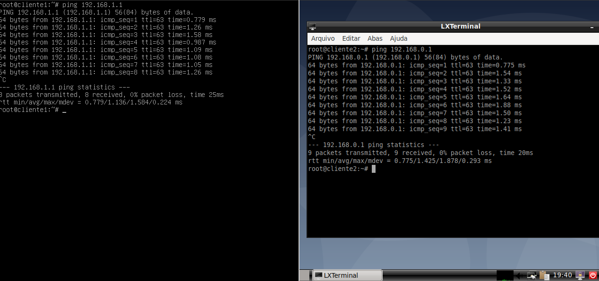

<h1> Atividade Assíncrona - Semana 3  Encaminhamento/Mascaramento </h1>

**Autor: Marcos Wesley Soares Alves**

**Matricula: 20181070130258**

Responda as seguintes perguntas:

1) O que é Servidor Nat?
    
    R: Pode ser entendido como um servidor que será responsável por fazer a tradução de endereços de uma rede interna para em endereços da Internet.

2) Qual é o arquivo do GNU/Linux Debian que permite/bloqueia o encaminhamento de pacotes?
    
    R: O nome do arquivo é ip_foward que se encontra no path: */proc/sys/net/ipv4*

3) O que é mascaramento de pacotes?

    R: É uma camada adicional de informação que permite ao servidor conhecer o host a qual o pacote deve ser encaminhado. 

4) O que é necessário ativar para que o servidor torne-se provedor de internet para os cliente 01 e 02?
   
    R: Ativar o encaminhamento de pacotes entre redes e fazer o mascaramento de pacotes.

            echo "1" > /proc/sys/net/ipv4/ip_forward

            iptables -t nat -A POSTROUTING -o eth0 -j MASQUERADE

            

5) Como ativar permanentemente o encaminhamento/mascaramento de pacotes no servidor? Em outras palavras, crie um tutorial (passo-a-passo) que indique uma forma permanente que garanta que o servidor, mesmo após o processo de reboot, seja um servidor NAT para os clientes do cenário de simulação, ou seja, faça o encaminhamento e o mascaramento de pacotes.

          
## Tutorial
**Criação de um script shell**

1 - Criar um arquivo shell script no diretório /etc/init.d que será executado sempre que o sistema operacional inicializar

   

    
   

2 - Adicionar os comando de ativação NAT e mascaramento de pacotes no arquivo shell.

    nano script_encaminhamento_mascaramento.sh

   

    
   

Após salvar o arquivo digite o seguinte comando para permitir a execução do script. Lembrando que é necessário estar dentro do mesmo diretório em que o arquivo se encontra(/etc/init.d).

    chmod+x script_encaminhamento_mascaramento.sh

3 - Crie um "link" desse arquivo no diretório /etc/rc2.d, porém no início do arquivo deve conter *S02*. O Sé referente a execução do script o 02 é o numero que ele será executado ou seja ele sera o segundo,a ser executado na inicializaçao do seu sistema.

    cp /etc/init.d/script_encaminhamento_mascaramento.sh /etc/rc2.d/S02script_encaminhamento_mascaramento.sh

   

    
   

4 - Agora é só reiniciar o servidor. Para testar, tente pingar o cliente1(192.168.0.1) no cliente2(192.168.1.1). Um outro teste pode ser a atualização de pacotes.

    ping 192.168.1.1
          e/ou
    apt-get update

- Teste com ping entre maquinas
   

    
   

- Teste com apt-get

   

    
   

  
- Teste com interface gráfica (a partir do cliente 2)

   

    
   
