## Atividade Assíncrona - Semana 2 (23/09/2020 a 29/09/2020)

**Autor: Marcos Wesley Soares Alves**

**Matricula: 20181070130258**

## Instalação do SSH

  - Primeiramente vamos atualizar o repositório debian onde está localizados os pacotes. Após acessar o servidor a partir do virtual box, digite o comando abaixo para fazer a atualização:
    
        apt-get update

- Com o repositório atualizado, agora vamos instalar o serviço **SSH** através do comando:

        apt-get install ssh

- **Acessando o servidor a partir do cliente**

    A partir do nosso ambiente de realização de atividades práticas onde temos dois computadores (cliente1 e cliente2). Vamos acessar a partir do cliente1 (sem interface gráfica) o servidor via SSH. 

    No debian o SSH cliente já está previamente carregado. Para verificar você pode digitar ssh na linha de comando. Se o serviço estiver disponível será apresentado algumas informações como na imagem abaixo:

    

        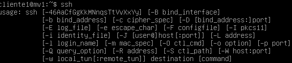
    

    Para fazer um acesso remoto do cliente via ssh ao servidor, vamos digitar o seguinte comando:

            ssh root@192.168.0.254

    No primeiro acesso que eu fizer via ssh a qualquer máquina vai aparecer essa mensagem perguntando se eu quero me conectar e vai informar um fingerprint da chave de criptografia da máquina. Essa chave será gravada em um arquivo para futuramente se eu acessar uma outra máquina cujo ip for o mesmo, será verificado se essa chave é a mesma. Por questão de segurança sempre será informado caso ele encontre uma nova chave ou uma chave diferente pra um determinado ip. Sabendo disso podemos colocar sim e apertar a tecla enter.

    

        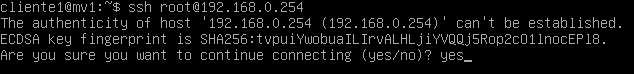
    

    Será solicitado a senha do usuário que você está tentando acessar, no nosso caso o usuário é root.

    

        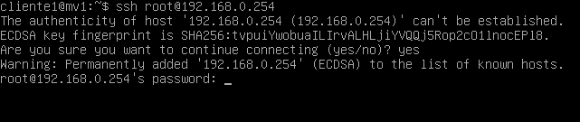
    

    Após informar a senha você vai estar conectado ao servidor.

     

        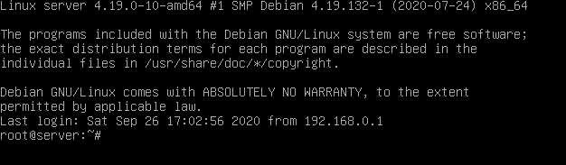
    

    Para verificar as máquinas que estão conectadas ao servidor, você pode usar o comando *who* ou apenas *w*.

     

        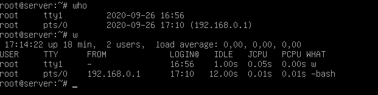
    

    Através dos comandos é possível verificar que a máquina de ip 192.168.0.1 está conectado ao servidor.

    Aprendemos nessa seção como instalar e nos conectar a um servidor via ssh(Secure Shell). Porém devemos tomar cuidado com algumas configurações de acesso como por exemplo a porta e o usuário ao qual estamos nos conectando, pois isso pode causar diversos problemas de segurança. Esse será o assunto do próximo tópico.

   
## Alterando arquivo de configuração do SSH

Por questões de segurança algumas configuração devem ser realizadas para dificultar um pouco o acesso ao nosso servidor via ssh. Nesse tópico vamos bloquear o acesso ao usuário root e mudar a porta padrão de acesso.

- **Bloqueando acesso ao usuário root e alterando a porta padrão**

Através do comando abaixo, é possível acessar o arquivo de configuração *sshd_config*. O editor que vou usar é o nano mas você pode usar outros como o vim ou o gedit.

    nano /etc/ssh/sshd_config

    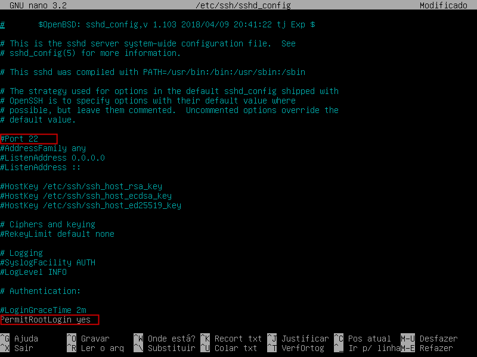

Podemos observar que a porta padrão é a porta 22 e a linha *PermitRootLogin* está configurado com yes, o que permite acessar o usuário root caso saibamos a senha. Vamos mudar essas configurações, colocando a porta como 2222 e passando **no** para a linha *PermitRootLogin*. Nosso arquivo de configuração deve ficar como a figura abaixo.

    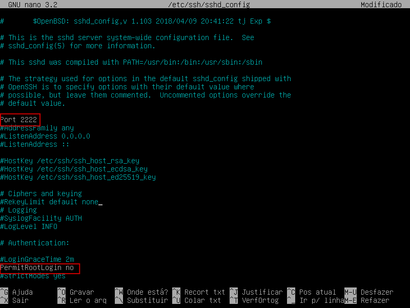

Para salvar é só apertar CTRL+O e em seguida confirmar como a tecla Enter. E por fim para voltar ao terminal CTRL+X.
Após modificar as configurações devemos reiniciar o serviço ssh para que as alterações sejam aplicadas. Para isso vamos digitar o seguinte comando no terminal.

    /etc/init.d/ssh restart

    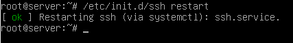

- Vamos fazer um teste e tentar acessar a partir do cliente1 o servidor como fizemos no tópico anterior.

    

        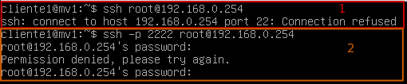
    

    Em 1, tentamos acessar com a porta padrão e o usuário root e então obtemos a mensagem Connection refused. 

    Em 2, colocamos a porta que haviamos definido e ainda assim não foi possível acessar o servidor através do usuário root (pois definimos que não deveria ser permitido acessar através desse usuário).

- Agora vamos tentar fazer o acesso usando outro usuário e passando a porta que definimos no arquivo de configuração.

    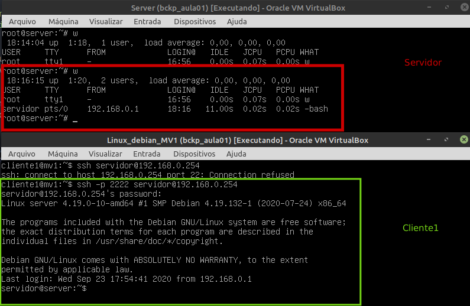

Usando o usuário *servidor* e passando a porta 2222 conseguimos realizar a conexão.

## Realizando cópia de arquivos do servidor para o cliente

Neste tópico será abordado a cópia de arquivos do servidor para o cliente. Podemos fazer essa transferência via rede usando o scp via terminal ou através de programas como gftp ou o filezilla caso esteja disponível um ambiente gráfico.

- **Sem ambiente gráfico (SCP)**

O SCP (Secure Copy) é um protocolo de rede para transferências de arquivos. Esse protocolo que iremos usar nesse exemplo

Passo 1: Criar um arquivo(file_teste) no servidor.

    touch arquivo_teste

    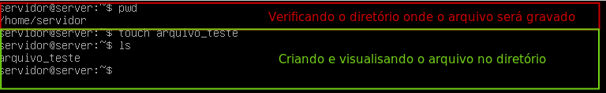

Com o arquivo criado vamos copiá-lo para o cliente1.

Passo 2: Cópia do arquivo através da rede

Para copiar o arquivo temos que saber o caminho onde ele se encontra na origem (servidor) e para qual caminho queremos salvar no destino(cliente). No nosso caso o path de origem é: */home/servidor* e o path de destino é: *home/cliente1*. Então usando o scp vamos conectar ao servidor e realizar a cópia do arquivo.

    scp -P 2222 servidor@192.168.0.254:home/servidor/arquivo_teste /home/cliente1

    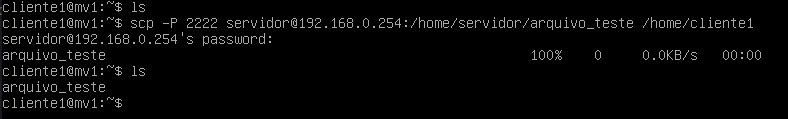

Como podemos observar através do comando *ls* o arquivo agora está na máquina cliente1.

-**Utilizando a interface gráfica (gftp)**

## Observações:
 - Mostrar na prática o uso do winscp e putty